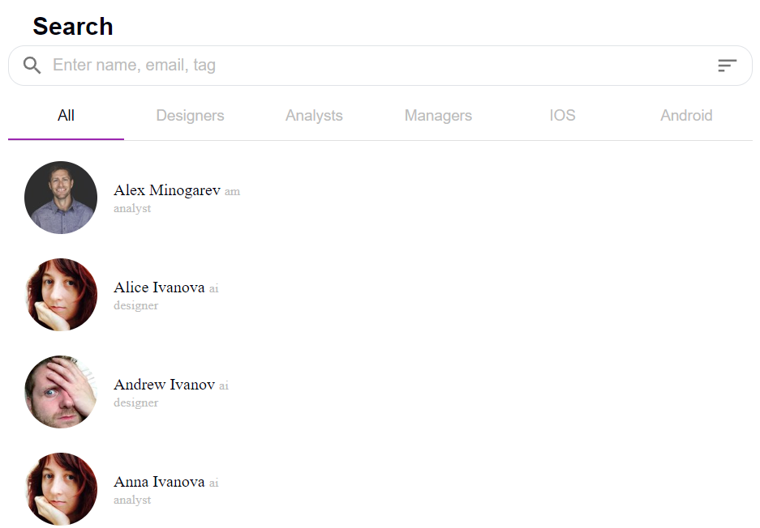

## About The Project

# Employees Directory

**Employees Directory** is a React and Redux-based application designed to provide a comprehensive view of employees across different departments within a company. The app offers functionalities to filter employees by departments, view detailed employee profiles, and sort or filter based on various criteria, such as age. This tool is ideal for quickly locating team members and reviewing organizational structure.You can view the live app here: <a href="https://employees-dir.netlify.app/" target="_blank">Employees Directory on Netlify</a>

## Features

- **Employee List by Department**: View employees organized by departments such as Management, Design, Analysis, iOS, and Android Development.
- **Profile Details**: Access detailed information about each employee, including their position, contact information, and date of birth.
- **Filtering Options**:
  - **By Department**: Quickly filter employees to view only those from specific departments.
  - **By Age and Other Criteria**: Filter employees by age and potentially other attributes (future expansion may include filters by experience or project involvement).
- **Efficient Data Loading**: The app uses Redux to manage global state, minimizing re-renders and optimizing data loading.

## Project Structure

- **Components**: UI components built with Material UI for a clean, responsive design.
- **State Management**: Redux manages global states for employee data, allowing for efficient fetching, filtering, and sorting of data.
- **Routing**: React Router enables seamless navigation between the main employee list view and individual employee details.

## Installation

1. Clone the repository: git clone https://github.com/Valentinka2222/employees_directory.git
2. Install dependencies: cd employee-directory npm instal
3. Run the app locally: npm start

## Usage

1. **View All Employees**: The main page shows a list of all employees, grouped by department.
2. **Filter by Department**: Use the department tabs to view employees from specific departments.
3. **View Employee Profile**: Click on an employee's name to view their detailed profile.
4. **Refresh Data**: If needed, use the page's reload feature to fetch the latest data.

## Technologies Used

- [React](https://reactjs.org/): For creating the user interface.
- [TypeScript](https://www.typescriptlang.org/): For adding static type definitions to enhance code quality and developer experience.
- [Redux Toolkit](https://redux-toolkit.js.org/): For efficient Redux development with simplified configuration and better defaults.
- [Styled Components](https://styled-components.com/): For writing CSS code within JavaScript, allowing for dynamic styling.
- [React Router](https://reactrouter.com/): For page navigation.
- [Material UI](https://mui.com/): For responsive, user-friendly UI components.
- [Moment.js](https://momentjs.com/): For managing and displaying date formats.

## Future Enhancements

- **Advanced Filtering**: Adding filters for more criteria like years of experience, role seniority, or project assignments.
- **Sorting Options**: Enabling sort options for employee names, joining dates, or other details.
- **Enhanced Error Handling**: More detailed error messages with potential solutions or reload suggestions.

## Contributing

Feel free to submit issues, suggestions, or pull requests! This project welcomes contributions to improve functionality and usability.

